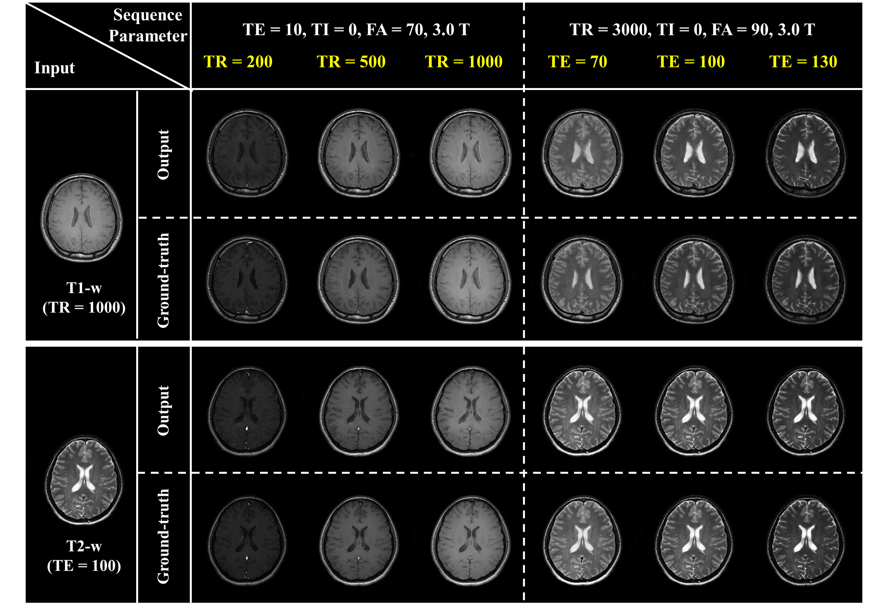
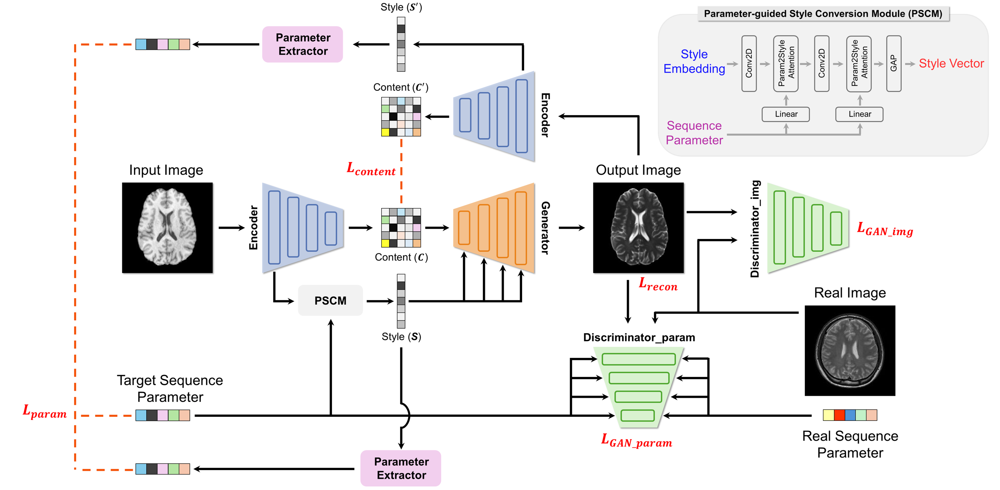

# SPCNet: MR Sequence Parameter Controllable Network for Multi-Contrast Magnetic Resonance Image Synthesis via Style Alignment and Parameter Inference

In this study, we propose the Sequence Parameter Controllable Network (SPCNet) that synthesizes multi-contrast images from a single acquired image. SPCNet decouples content and style within an MR image and adjusts the style based on the target MR sequence parameters. In conclusion, SPCNet enables the control of
contrast in MR images using sequence parameters.

## Results 
<p align="center">

</p>
Results of controlling MR image contrast using
MR sequence parameters. SPCNet receives T1-w and T2-w images,
along with six sequence parameters. When the
own sequence parameters are specified, the output images
remain unchanged. In contrast, when different sequence parameters
are specified, the output images are converted to the
contrast of the specified sequence. <br>


## Framework
<p align="center">

</p> 
Overview of the SPCNet architecture, which controls the contrast of MR images using MR sequence parameters. The
proposed network consists of four main parts: 1) an encoder that decouples MR image into content and style components, 2) a
parameter-guided style conversion module (PSCM) that adjusts the style based on the MR sequence parameters, 3) a generator
that synthesizes the decoupled content and modified style, and 4) a parameter extractor and dual discriminators that calculate
the loss function to update the network.

### Requirements
* python 3.11
* pytorch 2.2.2
* numpy, scikit-image, yaml, argparse, cv2, h5py
<br> 

### Testing 
Pretrained models: [vgg-model](https://drive.google.com/file/d/1BinnwM5AmIcVubr16tPTqxMjUCE8iu5M/view?usp=sharing),  [vit_embedding](https://drive.google.com/file/d/1C3xzTOWx8dUXXybxZwmjijZN8SrC3e4B/view?usp=sharing), [decoder](https://drive.google.com/file/d/1fIIVMTA_tPuaAAFtqizr6sd1XV7CX6F9/view?usp=sharing), [Transformer_module](https://drive.google.com/file/d/1dnobsaLeE889T_LncCkAA2RkqzwsfHYy/view?usp=sharing)   <br> 
Please download them and put them into the floder  ./experiments/  <br> 
```
python test.py  --content_dir input/content/ --style_dir input/style/    --output out
```
### Training  
Style dataset is WikiArt collected from [WIKIART](https://www.wikiart.org/)  <br>  
content dataset is COCO2014  <br>  
```
python train.py --style_dir ../../datasets/Images/ --content_dir ../../datasets/train2014 --save_dir models/ --batch_size 8
```
### Reference
If you find our work useful in your research, please cite our paper using the following BibTeX entry ~ Thank you ^ . ^. Paper Link [pdf](https://arxiv.org/abs/2105.14576)<br> 
```
@inproceedings{deng2021stytr2,
      title={StyTr^2: Image Style Transfer with Transformers}, 
      author={Yingying Deng and Fan Tang and Weiming Dong and Chongyang Ma and Xingjia Pan and Lei Wang and Changsheng Xu},
      booktitle={IEEE Conference on Computer Vision and Pattern Recognition (CVPR)},
      year={2022},
}
```
